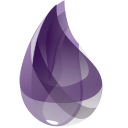

<h1 align="left">Hello, I'm Guillaume !
  
</h1>

- 💼 4th year IT student at **EPITECH, Bordeaux, France** (2019-2024)
- 🎓 1 year International Student at **San Francisco State University**, CS Graduate (2022-2023)
- 🧑‍💻 Full Stack Freelance Blockchain Developer (**Rust/Solidity/TypeScript** Lover)
- 👨‍🎓 Autonomous & Self-taught
- 🧗‍♂️ Climbing Evangelist
- 🏋️‍♂️ Zyzz Wannabe

For more information, don't hesitate looking up my [LinkedIn](https://www.linkedin.com/in/guillaumebogard) profile.
If you are wondering how to pronounce my first name, no problem, I got you [here](https://www.youtube.com/watch?v=pztow1Z2Ncw)!

### 🔨 Languages & Tools

  
  
  
  
  
  
  
  
  
  
  
  
  

   

  
  
  
  
  

   

  
  
  
  
  
  

   

  
  
  

### 📚 What I want to learn next

  

### 📫 Reach me

  
  

 

